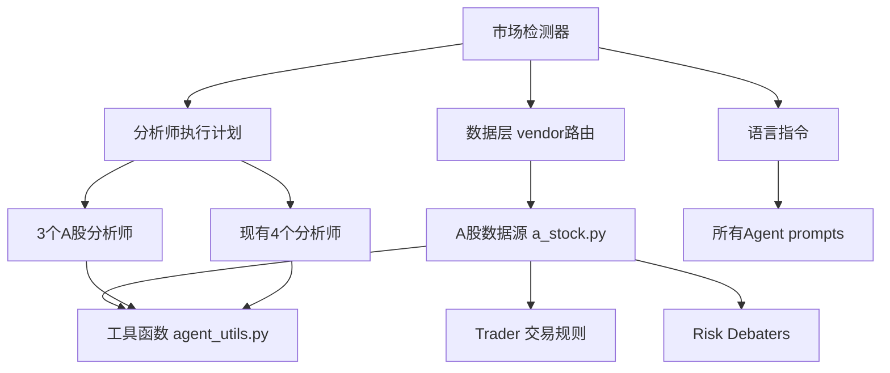

# A股市场集成设计文档

**日期:** 2026-08-13  
**方案:** 模块化市场扩展（Approach 1）  
**来源:** [TradingAgents-astock](https://github.com/simonlin1212/TradingAgents-astock) fork  
**状态:** 设计完成，待实施

---

## 1. 目标

将 TradingAgents-astock fork 中的A股分析能力完整整合到当前 TradingAgents 框架中，实现：

- 自动检测A股ticker并激活对应数据源和分析师
- 7个分析师（4基础 + 3 A股专属）协同工作
- 零API key的A股数据源（mootdx/东方财富/同花顺/财联社等）
- A股交易规则（T+1、涨跌停、最小手数）融入分析流程
- 保持美股/港股等现有市场分析不受影响

## 2. 整体架构

### 2.1 市场类型系统

新增 `market_type` 概念，在分析开始时从ticker自动检测：

```
用户输入 ticker (如 "600519" 或 "NVDA")
        ↓
   市场检测器 (markets/detector.py)
        ↓
   market_type = "astock" / "us" / "hk" / "crypto"
        ↓
   ┌─────────────────────────────────────┐
   │  数据层: 按 market_type 选 vendor    │
   │  分析师: 按 market_type 选组合       │
   │  Prompt: 按 market_type 切语言       │
   │  交易规则: 按 market_type 应用       │
   └─────────────────────────────────────┘
```

### 2.2 市场检测规则

| Ticker 模式 | Market Type | 示例 |
|---|---|---|
| 纯数字 (6位) | `astock` | `600519`, `000001` |
| `.SS` / `.SZ` 后缀 | `astock` | `600519.SS`, `000001.SZ` |
| `.HK` 后缀 | `hk` | `0700.HK` |
| `-USD` 后缀 | `crypto` | `BTC-USD` |
| 纯字母 / `.O` / `.N` | `us` | `NVDA`, `AAPL` |

**检测失败回退：** 当 `market_type == "auto"` 且无法从ticker模式判断时，回退到 `"us"`（当前默认行为），并输出警告日志。用户也可通过配置显式指定 `market_type` 跳过自动检测。

### 2.3 AgentState 扩展

复用现有 `asset_type` 字段，扩展枚举值为 `"us"` | `"astock"` | `"hk"` | `"crypto"`。`market_type` 在 `propagate()` 初始化时注入，所有节点可访问。

## 3. A股数据层

### 3.1 新增文件

`tradingagents/dataflows/a_stock.py` — A股数据源实现：

| 数据模块 | 来源 | 协议 | 提供的数据 |
|---|---|---|---|
| mootdx | 通达信行情服务器 | TCP 7709 | OHLCV K线、实时行情快照 |
| Tencent Finance | 腾讯财经 | HTTP | PE/PB/市值/换手率（实时报价）|
| Eastmoney | 东方财富 | HTTP | 龙虎榜、解禁日历、板块行情、资金流向、个股信息 |
| Sina Finance | 新浪财经 | HTTP | 历史K线、财务报表（资产负债表/利润表/现金流量表）|
| Tonghuashun | 同花顺 iFinD | HTTP | 机构一致预期EPS |
| CLS (Cailian) | 财联社 | HTTP | 全球财经快讯 |
| Baidu Stock | 百度股市通 | HTTP | 概念板块分类、资金流向 |

### 3.2 Vendor路由集成

在 `interface.py` 的 `VENDOR_METHODS` 中注册A股vendor：

```python
"a_stock": {
    "get_stock_data": a_stock.get_stock_data,           # mootdx
    "get_indicators": a_stock.get_indicators,            # mootdx + stockstats
    "get_fundamentals": a_stock.get_fundamentals,        # sina
    "get_balance_sheet": a_stock.get_balance_sheet,      # sina
    "get_cashflow": a_stock.get_cashflow,                # sina
    "get_income_statement": a_stock.get_income_statement, # sina
    "get_news": a_stock.get_news,                        # cailian + eastmoney
    "get_global_news": a_stock.get_global_news,          # cailian
    "get_insider_transactions": a_stock.get_insider_transactions, # eastmoney
    "get_fund_flow": a_stock.get_fund_flow,              # eastmoney + baidu
    "get_profit_forecast": a_stock.get_profit_forecast,  # tonghuashun
    "get_lockup_expiry": a_stock.get_lockup_expiry,      # eastmoney
    "get_hot_stocks": a_stock.get_hot_stocks,            # eastmoney
}
```

### 3.3 路由策略

当 `market_type == "astock"` 时，`data_vendors` 配置自动覆盖为A股vendor链：

```python
# 默认 (美股)
"data_vendors": {"core_stock_apis": "yfinance", ...}

# A股模式自动覆盖
"data_vendors": {"core_stock_apis": "a_stock", ...}
```

### 3.4 Rate Limiting（东方财富）

东方财富限流策略（>5 req/s 或 >=10并发 或 >=200/min 会封IP）：

- 串行请求间隔 >= 1秒 + 0.1-0.5秒随机抖动
- Keep-Alive session 复用
- 可配置的 `EM_MIN_INTERVAL` 环境变量

### 3.5 依赖

```toml
# pyproject.toml 新增
"mootdx>=0.11.7",
```

### 3.6 零API Key

所有A股数据源均为免费公开接口，无需配置任何API key。

## 4. A股分析师（3个新Agent）

### 4.1 新增分析师

| 分析师 | 文件 | 角色定位 | 专属工具 |
|---|---|---|---|
| 政策分析师 | `agents/analysts/policy_analyst.py` | 分析监管和政府政策影响 | `get_news`, `get_global_news` |
| 游资追踪 | `agents/analysts/hot_money_tracker.py` | 追踪短线游资资金动向 | `get_stock_data`, `get_news`, `get_fund_flow`, `get_insider_transactions` |
| 解禁监控 | `agents/analysts/lockup_watcher.py` | 监控限售股解禁和大股东减持 | `get_insider_transactions`, `get_news`, `get_fundamentals`, `get_lockup_expiry` |

### 4.2 条件执行

在 `analyst_execution.py` 中注册A股分析师：

```python
# 现有4个分析师 — 所有市场都执行
ANALYST_NODE_SPECS = {...}

# 新增A股分析师 — 仅 astock 市场执行
ASTOCK_ANALYST_NODE_SPECS = {
    "policy": {...},
    "hot_money": {...},
    "lockup": {...},
}
```

`AnalystExecutionPlan` 根据 `market_type` 决定执行哪些分析师：
- A股模式：执行全部7个（4基础 + 3 A股专属）
- 美股/港股模式：执行原有4个

**LLM分配：** A股专属的3个分析师与现有4个分析师使用相同的LLM配置——均使用 `quick_think_llm`（快速推理模型），不额外引入新的模型分配逻辑。

### 4.3 Prompt设计

所有A股分析师使用中文prompt，包含A股特有分析框架：

**政策分析师：** 五层分析框架
1. 宏观政策（货币政策、财政政策）
2. 监管政策（证监会、交易所规则）
3. 产业政策（行业扶持/限制）
4. 地方政策（地方补贴、园区政策）
5. 国际政策（中美关系、贸易政策）

**游资追踪：** 核心短线定价力分析
- 量价异动信号
- 涨停板封板/炸板信号
- 板块轮动节奏
- 龙虎榜席位分析

**解禁监控：** 供给冲击评估
- 解禁类型（首发、定增、股权激励）
- 压力规模（占流通盘比例）
- 大股东减持意愿
- 监管约束（减持新规）

### 4.4 Quality Gate

现有 `quality_gate.py` 保持不变，验证所有7个分析师报告（A股模式下）的质量后再进入辩论环节。

## 5. Prompt适配与A股交易规则

### 5.1 语言切换

在 `agent_utils.py` 的 `get_language_instruction()` 中扩展：

- `market_type == "astock"` → 中文prompt（分析师团队全部使用中文）
- `market_type == "us"` / `"hk"` → 英文prompt（保持现有行为）

**现有4个分析师的prompt适配：** 当 `market_type == "astock"` 时，现有4个分析师（Market/Sentiment/News/Fundamentals）也切换为中文prompt，并在分析框架中加入A股特有考量（如北向资金、散户行为、政策敏感度），但不改变其核心工具集和职责边界。

内部辩论（Bull/Bear研究员）保持英文推理以保证LLM推理质量。最终输出语言由 `output_language` 配置控制。

### 5.2 A股交易规则注入

在 **Trader Agent** 的prompt中，当 `market_type == "astock"` 时注入：

| 规则 | 说明 |
|---|---|
| T+1 | 当天买入的股票次日才能卖出 |
| 涨跌停限制 | 主板±10%，科创板/创业板±20%，ST股±5% |
| 最小交易单位 | 1手 = 100股 |
| 交易时段 | 9:30-11:30, 13:00-15:00 |
| 北向资金 | 外资流入流出的重要信号 |
| 价格表述限制 | 不允许声明具体价格点位、止损位或仓位比例 |

### 5.3 Risk Debater适配

三方辩论prompt适配A股语境：

- **保守分析师：** T+1锁定风险、涨跌停陷阱、政策反转风险、散户踩踏
- **激进分析师：** 政策驱动的结构性机会、板块轮动收益、主题投资
- **中性分析师：** 平衡视角，考虑A股散户主导市场特征

### 5.4 配置扩展

`DEFAULT_CONFIG` 新增：

```python
"market_type": "auto",           # "auto" | "us" | "astock" | "hk"
"astock_lookback_days": 60,      # A股技术分析回看天数
"astock_trading_sessions": True, # 是否考虑交易时段限制
```

## 6. 图工作流与集成

### 6.1 LangGraph动态构建

在 `graph/setup.py` 中，根据 `market_type` 动态构建分析师节点：

```python
def _add_analyst_nodes(graph, market_type, ...):
    specs = ANALYST_NODE_SPECS.copy()
    if market_type == "astock":
        specs.update(ASTOCK_ANALYST_NODE_SPECS)
    for spec in specs.values():
        graph.add_node(spec.name, spec.factory(...))
```

### 6.2 Benchmark适配

A股benchmark自动切换：
- 美股：SPY（现有）
- A股：沪深300指数 `000300.SS`（通过yfinance获取）

### 6.3 CLI集成

- ticker输入支持纯数字（如 `600519`），自动检测为A股
- A股分析时显示7个分析师的进度
- 报告输出语言默认为中文

### 6.4 API集成

`POST /api/analyze` 的请求体新增可选字段 `market_type`（默认 `"auto"`）。

## 7. 文件变更清单

### 新增文件

| 文件 | 用途 |
|---|---|
| `tradingagents/markets/detector.py` | 集中式市场检测模块 |
| `tradingagents/dataflows/a_stock.py` | A股数据源实现（mootdx/腾讯/东方财富/新浪/同花顺/财联社/百度）|
| `tradingagents/agents/analysts/policy_analyst.py` | 政策分析师 |
| `tradingagents/agents/analysts/hot_money_tracker.py` | 游资追踪分析师 |
| `tradingagents/agents/analysts/lockup_watcher.py` | 解禁监控分析师 |

### 修改文件

| 文件 | 变更内容 |
|---|---|
| `tradingagents/dataflows/interface.py` | 注册a_stock vendor方法映射 |
| `tradingagents/graph/setup.py` | 动态分析师节点构建 |
| `tradingagents/graph/trading_graph.py` | market_type注入和传播 |
| `tradingagents/graph/propagation.py` | 市场检测调用 |
| `tradingagents/agents/utils/agent_utils.py` | 语言指令适配（market_type→语言）|
| `tradingagents/agents/analyst_execution.py` | A股分析师注册 |
| `tradingagents/agents/trader/trader.py` | A股交易规则prompt |
| `tradingagents/agents/risk_mgmt/aggressive_debator.py` | A股风险prompt |
| `tradingagents/agents/risk_mgmt/conservative_debator.py` | A股风险prompt |
| `tradingagents/agents/risk_mgmt/neutral_debator.py` | A股风险prompt |
| `tradingagents/default_config.py` | A股配置项 |
| `tradingagents/agents/utils/agent_states.py` | market_type字段 |
| `pyproject.toml` | 新增mootdx依赖 |
| `cli/main.py` | ticker检测、A股进度显示 |
| `tradingagents_api/schemas.py` | market_type字段 |

### 不变更

- LLM客户端层（保持现有18+供应商架构）
- 现有美股/港股分析流程
- Desktop GUI（Tauri前端）
- 现有4个分析师的核心逻辑
- Bull/Bear研究员核心逻辑
- Research Manager / Portfolio Manager 核心逻辑

## 8. 依赖关系



## 9. 风险与缓解

| 风险 | 影响 | 缓解 |
|---|---|---|
| 东方财富限流/封IP | 数据获取失败 | 严格限流策略 + vendor fallback |
| mootdx服务器不可用 | K线数据缺失 | fallback到yfinance的A股数据 |
| 中文prompt占用更多token | 成本增加 | prompt精简，必要时截断 |
| 7个分析师运行时间过长 | 用户等待久 | 可选启用/禁用A股分析师 |
| 两个市场代码路径增加维护负担 | 长期维护成本 | 共用核心逻辑，仅差异部分分支 |
